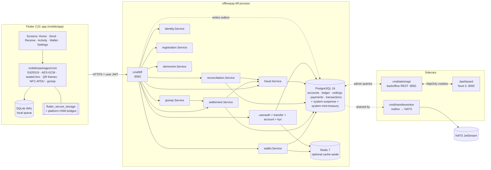
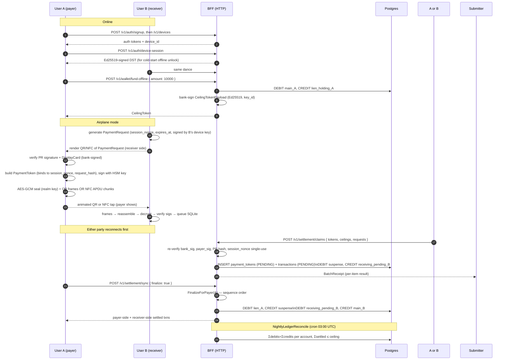
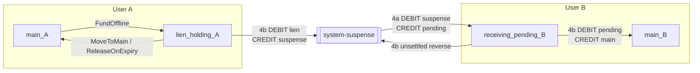

# Architecture

## System overview

OfflinePay is a C2C offline-first QR payment network for Nigeria. Every registered user can both send and receive; "payer" and "receiver" are per-transaction roles, not separate apps. Offline spend is backed by a stored-value **ceiling token** — an Ed25519-signed authorisation issued online when the user funds their offline wallet. Funding places a hard lien on main-wallet funds so auto-settlement is always solvent. A payment is a payer-signed `PaymentToken` that counter-signs a receiver-issued `PaymentRequest`; the contract is transported over an animated QR (or NFC), verified entirely on the receiver's device, and queued in local SQLite. The backend runs two-phase settlement (`SubmitClaim` → `FinalizeForPayer`), a nightly double-entry reconciliation, and a gossip carriage layer that lets any device on the mesh settle blobs it didn't originate.

For this PoC the whole backend ships as a single Go HTTP binary (`cmd/bff`). The OpenAPI spec is the client contract; wallet, settlement, gossip, reconciliation, identity, and device registration are Go packages invoked in-process. An earlier split into a gRPC settlement server behind an API gateway was collapsed back into the BFF during PoC cleanup — the `internal/transport/grpc` tree survives as internal DTOs and handler shapes, not as a wire-level service.

Alongside the BFF there are two auxiliary binaries:

- `cmd/adminapi` — a separate HTTP service (`:8081`) that powers the Nuxt backoffice. Email + bcrypt login, its own session table, RBAC with five seeded roles.
- `cmd/transferworker` — a dispatcher + processor pair for the transactional-outbox path behind online P2P transfers. NATS JetStream carries the events; ledger mutation happens in the worker, never in the BFF request handler.

Two CLIs round out the picture: `cmd/opsctl` (day-to-day rituals — key rotation, freeze user, release lien, recon now, generate device-session keys, create admin users) and `cmd/opsim` (one-shot in-process settlement simulator you can point at a local Postgres).

## Service topology



Repository access is funnelled through package-scoped repos (`internal/repository/{pgrepo,userauthrepo,transferrepo,accountrepo,kycrepo,adminrepo,fraudrepo,opsrepo}`) that wrap SQLC-generated queries in domain-typed methods. The Redis cache-aside layer (`internal/cache`) sits in front of the six hottest reads: device auth lookup, user KYC tier, receiver resolution by account number, active bank signing key, active realm keys, user account number. When `REDIS_URL` is empty or unreachable, `cache.Noop` takes over silently — no call site needs to care.

The in-process handlers in `internal/transport/grpc/server/` — `WalletServer`, `SettlementServer`, `KeysServer`, `RegistrationServer` — are plain Go structs that map protobuf DTOs onto domain types on behalf of the BFF. The package name is historical baggage from the pre-collapse architecture; there is no gRPC wire transport involved.

## Happy-path sequence (register → settle)



Two things worth noticing against the older sequence diagram:

1. **PaymentRequest first, PaymentToken second.** The receiver issues a signed invoice (`PaymentRequest` — with a 16-byte `session_nonce` and a hash-bound amount) before the payer produces a `PaymentToken`. The payer's token embeds `session_nonce` and `request_hash` so the server can re-verify the contract at settlement time. Migration `0024_payment_request_binding` introduced this and it's now mandatory on `POST /v1/settlement/claims`.
2. **Either side can submit.** A claim may be uploaded by the payer *or* the payee — whichever device reaches connectivity first drains its queue. `payment_tokens.submitted_by_user_id` (migration `0025`) records which party won the race so auditors can trace provenance.

## QR two-layer encryption data flow

```mermaid
flowchart TB
  PR[PaymentRequest\nreceiver-signed] --> PRScan[Payer scans PR]
  PRScan --> Build[Build PaymentToken\npayer_id, payee_id, amount,\nsequence_number, session_nonce,\nrequest_hash]
  Build --> CJ[Canonicalise\ninternal/crypto/canonical.go]
  CJ --> Sig[Ed25519-sign\nwith HSM payer key]
  Sig --> PT[PaymentToken + sig]

  subgraph Inner["Gossip inner payload (optional)"]
    GP[WireInnerPayload\ngossip/service.go]
    GP --> CJ2[Canonicalise] --> SB[SealAnonymous\nX25519 + blake2b-24 nonce\n+ NaCl box]
    SB --> Blob[sealed GossipBlob]
  end

  PT --> Env[GossipEnvelope\npayment + ceiling + blobs]
  Blob --> Env
  Env --> AES[AES-256-GCM Seal\nrealm key v, base_nonce\n+ DeriveFrameNonce\ninternal/crypto/aes_gcm.go]
  AES --> Chunk[pkg/qr.Chunk\nheader(SHA-256) + payloads + trailer]
  Chunk --> Frames[Animated QR frames OR NFC APDU chunks\n[key_version:1B][nonce:12B][GCM ct][tag:16B]]
  Frames -. scan / tap .-> RX[Receiver]
  RX --> Reassemble[pkg/qr.Reassembler or NfcReassembler]
  Reassemble --> AES2[AES-GCM Open] --> PTRX[PaymentToken + sig + Blob*]
```

Layer 1 (realm key, AES-256-GCM) hides payloads from casual scanners; Layer 2 (server X25519 sealed box) keeps gossip blobs opaque to everyone except the backend. Both QR and NFC share the same sealed wire bytes — the NFC path wraps them in an APDU pull protocol (`SELECT` → `GET_CHUNK`), the QR path chunks them into animated frames. See `mobile/packages/core/lib/src/transport/`.

## Account model and double-entry flow

Every user has **three** kind-keyed accounts (migration `0005_accounts`):

| kind                | signed? | role |
|---------------------|---------|------|
| `main`              | nonneg  | spendable main wallet; credited by top-up, transfers in, and Phase 4b settlement. |
| `lien_holding`      | nonneg  | funds held behind an active ceiling token. |
| `receiving_pending` | nonneg  | claims accepted in Phase 4a, not yet finalised. |

There is also one **system-owned** account outside the per-user set:

- `system-suspense` (owner `system-settlement`, kind `suspense`) — the only account allowed to carry a negative balance, used as the counterparty between Phase 4a and Phase 4b postings.

Plus two demo-only rows seeded by migration `0021`: `system-mint-treasury` (`kind=main`, pre-funded with ₦5B) and `system-mint-source` (`kind=suspense`, counterweight). Both are owned by the sentinel `system-mint` user.

**There is no `offline` account and no `receiving_available` account.** The offline balance is *derived* on-device from `ceiling.CeilingAmount - Σ(payments already signed)`. Phase 4b credits the receiver's **main** directly — the old `receiving_available` hop was ceremonial and was removed.



Ledger postings live in `backend/internal/service/settlement/service.go` and `wallet/service.go`:

| Phase | Debit | Credit | Purpose |
|------:|:------|:-------|:--------|
| Fund offline | `main_A` | `lien_holding_A` | place hard lien |
| 4a per claim (amount A) | `suspense` | `receiving_pending_B` | recognise claim |
| 4b settled X | `lien_holding_A`, `receiving_pending_B` | `suspense`, `main_B` | drain lien, bucket-move |
| 4b unsettled Y | `receiving_pending_B` | `suspense` | reverse 4a for shortfall |
| Expiry / MoveToMain / Recovery release | `lien_holding_A` | `main_A` | release lien |

After all pending claims for a ceiling reach a terminal state, `suspense` returns to zero; the nightly reconciler verifies this.

### Transactions as a user-facing event log

Migration `0018_transactions` introduced a first-class business-event log. Every ledger-impacting operation writes one `transactions` row **per affected user** in the same `Repo.Tx` as its ledger posts and balance updates:

- Two-party events (offline payment, P2P transfer) write two rows paired by `group_id`, with `direction` encoding each user's POV. The DEBIT side's `id` is reused as the `ledger_entries.txn_id`, so the deferred FK `ledger_entries.txn_id → transactions.id` lands.
- Single-party events (`OFFLINE_FUND`, `OFFLINE_DRAIN`, `OFFLINE_EXPIRY_RELEASE`, `OFFLINE_RECOVERY_RELEASE`, `DEMO_MINT`) write one row with `group_id = id`.

Enum `transaction_kind` is the canonical list; new kinds are added by migration. The dashboard and mobile-app activity feeds read directly from this table — the `ledger_entries` detail is backing evidence, not user-facing.

## Ceiling recovery

Migrations `0022` / `0023` added a middle state between `ACTIVE` and `REVOKED`:

```
ACTIVE → RECOVERY_PENDING → (release_after elapsed) → REVOKED
       ↘ EXHAUSTED / EXPIRED
```

`RECOVERY_PENDING` means "the user said they lost the device holding this ceiling, but merchants may still be carrying payments we haven't seen yet." `release_after = expires_at + AutoSettleTimeout + ClockGrace` (default ~75h) gives those in-flight claims time to surface via gossip. The lien stays locked for that window. When the sweep fires, `wallet.ReleaseOnExpiry` drains the remaining lien back to `main`, tags the transaction `OFFLINE_RECOVERY_RELEASE`, and marks the ceiling `REVOKED`. The HTTP endpoint is `POST /v1/wallet/recover-offline-ceiling`.

The partial unique index was broadened in `0023` from `WHERE status='ACTIVE'` to `WHERE status IN ('ACTIVE','RECOVERY_PENDING')` so a user can't double-fund while a recovery is in flight.

## File-tree summary

### `backend/`

```
backend/
  Makefile                   # test / lint / sqlc / proto / migrate / bff / e2e / chaos-*
  buf.yaml, buf.gen.yaml     # buf lint + codegen config for proto message types
  sqlc.yaml                  # sqlc config → internal/repository/sqlcgen
  api/
    openapi.yaml             # source of truth for the HTTP API (~3k lines)
    embed.go                 # embeds the spec into the BFF binary
  cmd/
    bff/                     # single HTTP binary: handlers, in-process services, crons
    adminapi/                # backoffice REST API (:8081)
    transferworker/          # async outbox → NATS processor
    opsctl/                  # operator CLI (rotate keys, freeze users, gen DST keys…)
    opsim/                   # in-process settlement simulator
    rotate_realm_key/        # legacy standalone rotation CLI
    rotate_sealedbox_key/    # X25519 keypair generator
    e2e/                     # integration + scale suite (tags: e2e, integration, scale)
  db/
    migrations/              # 0001–0025 numbered up/down SQL
    queries/                 # SQLC source (accounts, admin, bank_keys, ceilings, devices,
                             #   fraud, kyc, ledger, outbox, payments, processed_events,
                             #   push_tokens, realm_keys, reconciliation, signing_keys,
                             #   transactions, transfers, user_auth, user_pins, users)
  proto/
    offlinepay/v1/           # common, wallet, settlement, keys, registration
  pkg/
    qr/frames.go             # animated QR frame wire format + Reassembler
  internal/
    auth/                    # JWT + device-session token crypto (no I/O)
    config/                  # env-based Config loader (used by opsctl)
    crypto/                  # Ed25519 sign/verify · AES-256-GCM · X25519 sealed-box · canonical JSON
      kms/                   # LocalSigner (Postgres) · VaultSigner (Vault Transit)
    domain/                  # pure domain types — the only place signatures are defined
    observability/           # OpenTelemetry tracing + Prometheus metrics glue
    logging/                 # slog setup
    cache/                   # optional Redis cache-aside
    repository/
      pgrepo/                # primary repo over sqlcgen (Tx, ledger, balances, mappings)
      userauthrepo/          # auth/session/OTP reads (separate struct, shared pool)
      transferrepo/          # transfer service adapter
      accountrepo/kycrepo/adminrepo/fraudrepo/opsrepo/
      migrate/               # golang-migrate wrapper (embed.FS)
      sqlcgen/               # generated SQLC output (never hand-edited)
    service/
      wallet/                # FundOffline, MoveToMain, Refresh, Recover, ReleaseOnExpiry
      settlement/            # SubmitClaim (4a), FinalizeForPayer (4b), AutoSettleSweep
      gossip/                # sealed-box open → route to SubmitClaim
      reconciliation/        # SyncUser, BatchReceipt, NightlyLedgerReconcile
      fraud/                 # signal recording, decayed scoring, transfer scoring
      identity/              # DisplayCard issuance (bank-signed identity credential)
      registration/          # device registration + attestation hooks
      userauth/              # signup/login/OTP/JWT/PIN/device-session
      transfer/              # outbox-backed online P2P transfers
      account/kyc/admin/demomint/notification/
    transport/
      grpc/gen/              # generated proto message types (internal DTOs only)
      grpc/server/           # in-process wallet/settlement/keys/registration handlers
      http/bff/              # BFF handlers wired to oapi-codegen strict server
      http/bff/gen/          # generated OpenAPI server + types
      http/bff/demo/         # dev-only funding page
      http/admin/            # admin REST handlers (stdlib mux)
```

### `mobile/`

```
mobile/
  app/                       # single unified Flutter C2C app
    lib/
      main.dart
      firebase_options.dart
      src/
        app.dart              # _RootGate routes on SessionCubit.state.gate
        theme.dart
        core/
          auth/               # JWT parsing, refresh interceptor
          di/                 # service locator (get_it)
          http/               # Dio stack + token plumbing
        presentation/
          cubits/             # session, wallet, settlement, activity, kyc, …
        screens/
          auth/               # login, signup, email_verify, forgot_password, unlock
          send_money/         # multi-step send flow (account → amount → confirm → result)
          home_screen.dart · receive_screen.dart · receive_nfc.dart ·
          activity_screen.dart · wallet_screen.dart · settings_screen.dart ·
          sessions_screen.dart · kyc_submit_screen.dart · tiers_screen.dart ·
          set_pin_screen.dart
        services/
          local_queue.dart         # SQLite WAL queue for offline txns
          sync.dart · claim_submitter.dart · receive_coordinator.dart
          payment_verifier.dart · qr_receiver.dart
          keystore.dart · software_signer.dart · signer.dart
          offline_auth.dart · session_store.dart · biometric_unlock.dart
          gossip_pool.dart · gossip_uploader.dart
          device_registrar.dart · push_notifications_service.dart
          connectivity.dart · install_sentinel.dart
        nfc/                  # Flutter-side NFC channels + transports
        repositories/         # Dio call wrappers per API group
        widgets/ util/
    test/                     # widget + service tests
  packages/
    offlinepay_api/           # dart-dio client generated from backend openapi.yaml
    core/                     # shared Dart primitives (pure Dart, no Flutter)
      lib/src/
        canonical.dart · tokens.dart · ed25519.dart · aes_gcm.dart ·
        sealed_box.dart · realm_keyring.dart · request_wire.dart
        qr/frames.dart
        gossip/{bloom, carry_cache, envelope, encode, payload, wire}.dart
        transport/{transport, qr_transport, nfc_apdu, nfc_pull_protocol}.dart
      test/fixtures/crosslang.json  # Go-generated; Dart must verify byte-for-byte
```

### `dashboard/`

Nuxt 3 + Vue 3 + Pinia backoffice. Talks to `adminapi` via a server-side Nuxt BFF that keeps access/refresh tokens in httpOnly cookies. Pages today: login, overview, users list + detail, transactions list + detail, settlement batches list + detail, fraud list. Dockerfile + compose entry ships in the repo.

### `ops/` and `docker-compose.yml`

`docker-compose.yml` at the repo root stands up the full local stack: `postgres` (16), `redis` (7), `nats` (JetStream), `bff`, `adminapi`, `transferworker`, `dashboard`, plus the observability sidecars — Prometheus, Alertmanager, Loki + Promtail, Tempo, Grafana, and Metabase. `ops/` holds the grafana dashboards, prometheus + loki + tempo + alertmanager configs, and the chaos scripts (`ops/chaos/*.sh` — NATS kill, Postgres restart, worker stop).

See `docs/PROTOCOL.md` for the wire-format details and `docs/API.md` for the HTTP surface.
